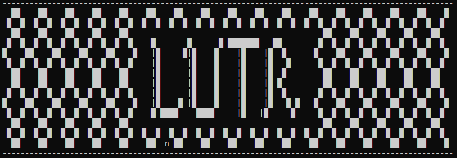
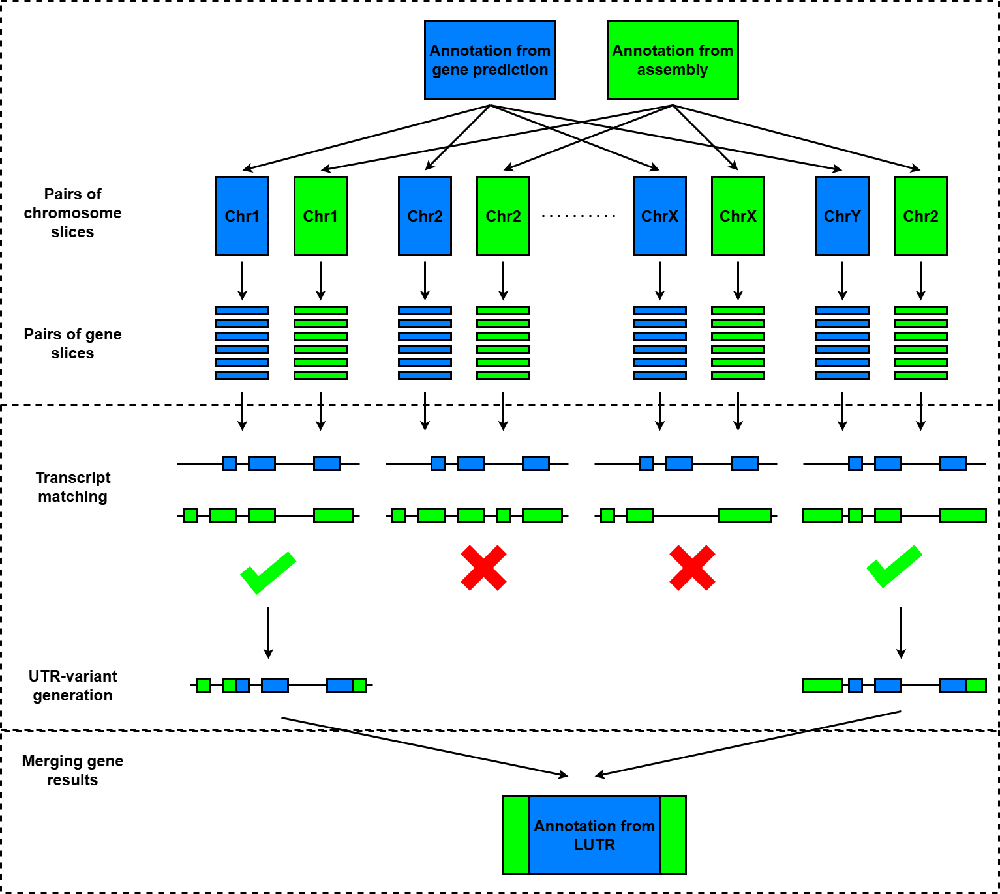
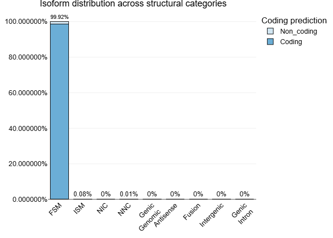
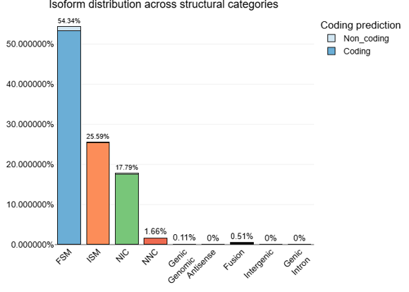

<p align="center">
  
</p>
<p align="center">
  
</p>

When comparing transcripts of the Bible in its original language and the Bible in Latin,
Martin Luther realized that some of its meaning had been lost in translation. Similarly,
UnTranslated Regions (UTRs) are lost in translation. However, to us biologist and
bioinformaticians they are of great importance as they have a variety of regulatory
functions and a genome annotation without them wouldn't really be complete, right?

Protein ortholog-based gene prediction enables the transfer of detailed gene structure and
functional annotations across species by leveraging evolutionary conservation. However,
genome annotations from such methods typically lack the less conserved UTRs. LUTR
supplements these by using matching transcripts from reference-based transcriptome assemblies.

LUTR succeeds [UTRpy](https://github.com/SimonHegele/UTRpy), which it differs from mainly by
it's parallelization strategy.

## 1 Installation

```
git clone https://github.com/SimonHegele/LUTR
cd LUTR
conda create -n lutr python=3.13
conda activate lutr
pip install .
```

Additional dependencies required to use the assembly pipeline:
- [AGAT](https://github.com/NBISweden/AGAT)
- [Minimap2](https://github.com/lh3/minimap2)
- [Samtools](https://github.com/samtools/samtools)
- [STAR](https://github.com/alexdobin/STAR)
- [StringTie](https://github.com/gpertea/stringtie)

## 2 Usage

```
usage: LUTR [-h] [-mf] [-mb] [-nm] [-ma] [-s] [-mupl] [-r] [-t] [-v] [-l] prediction assembly outdir

                    ----------------------------------------------------------------------------------------------------
                      ██░   ██░   ██░   ██░   ██░   ██░   ██░   ██░   ██░   ██░   ██░   ██░   ██░   ██░   ██░   ██░   █░
                     █░ █░ █░ █░ █░ █░ █░ █░ █░ █░ █░ █░ █░ █░ █░ █░ █░ █░ █░ █░ █░ █░ █░ █░ █░ █░ █░ █░ █░ █░ █░ █░ █░
                      ██░   ██░   ██░   ██░   ██░                                          ██░   ██░   ██░   ██░   ██░
                     █░ █░ █░ █░ █░ █░ █░ █░ █░ █░   █░      █░     █░███████░  ██░       █░ █░ █░ █░ █░ █░ █░ █░ █░ █░
                    █░   ██░   ██░   ██░   ██░   █░  |█░    █|█░   █░   |█░   |█░ █░     █░   ██░   ██░   ██░   ██░   █░
                     █░ █░ █░ █░ █░ █░ █░ █░ █░ █░   |█░     |█░   █░   |█░   |█░  █░     █░ █░ █░ █░ █░ █░ █░ █░ █░ █░
                      ██░   ██░   ██░   ██░   ██░    |█░     |█░   █░   |█░   |█░ █░       ██░   ██░   ██░   ██░   ██░
                      ██░   ██░   ██░   ██░   ██░    |█░     |█░   █░   |█░   |█░█░        ██░   ██░   ██░   ██░   ██░
                     █░ █░ █░ █░ █░ █░ █░ █░ █░ █░   |█░     |█░   █░   |█░   |█░ █░      █░ █░ █░ █░ █░ █░ █░ █░ █░ █░
                    █░   ██░   ██░   ██░   ██░   █░  |█░   █░|█░   █░   |█░   |█░  █░█░  █░   ██░   ██░   ██░   ██░   █░
                     █░ █░ █░ █░ █░ █░ █░ █░ █░ █░   █ ████░   ████░    |█░  |█░    █░    █░ █░ █░ █░ █░ █░ █░ █░ █░ █░
                      ██░   ██░   ██░   ██░   ██░                                          ██░   ██░   ██░   ██░   ██░
                     █░ █░ █░ █░ █░ █░ █░ █░ █░ █░ █░ █░ █░ █░ █░ █░ █░ █░ █░ █░ █░ █░ █░ █░ █░ █░ █░ █░ █░ █░ █░ █░ █░
                      ██░   ██░   ██░   ██░   ██░   ██░   ██░   ██░   ██░   ██░   ██░   ██░   ██░   ██░   ██░   ██░   █░
                    ----------------------------------------------------------------------------------------------------

                    UTR-extensions for transcripts in functional annotations from orthology-based gene prediction tools
                    using matching transcripts in structural annotations from reference-based transcriptome assembly.

                    Additional parameter explanation:
                    *1 By default, LUTR only allows transcript matches in which all other exons between the first and
                       last matched exon must also be matched exactly. This is based on the assumption that UTRs can
                       affect splicing within the coding regions of a transcript, e.g. by changing its secondary
                       structure.
                    *2 By default, LUTR assignes assembled transcripts only to the matching predicted transcripts they
                       share the most bases with. Assigning them to all matching predicted transcripts can increase the
                       number of annotated UTRs but bears the risk of an increased rate of false positives.
                    ----------------------------------------------------------------------------------------------------


positional arguments:
  prediction                    Annotation from gene prediction (GFF)
  assembly                      Annotation from transcriptome assembly (GFF)
  outdir                        Output directory (Must not exist already)

options:
  -h, --help                    show this help message and exit

Transcript matching:
  -mf, --mftm                   Minimum fraction of the predicted transcript to be matched [default: 0.9]
  -mb, --mtbm                   Minimum bases of the predicted transcript to be matched [default: 10,000]
  -nm, --no_match_middle        Allows missing / additional middle exons in the transcrpt matching *1
  -ma, --match_all              Assign assembled transcripts to all matching predicted transcripts *2
  -mupl, --max_utr_piece_len    Limits the length of UTR-pieces allowed in UTR-variants # TODO

Transcript selection:
  -s , --select                 How to select from multiple UTR-variants [choices: shortest, longest, all] [default: all]
  -r, --remove_unsupported      Remove unmatched transcripts

Performance:
  -t , --threads                Number of parallel processes to use [Default:8]

Others:
  -v , --verbosity              Report progress every 10^v genes [default: 0]
  -l , --log_level              [default: info]
```

### 2.1 Input

Input annotations are required to be in GFF3 format.
agat_sp_convert_sp_gxf2gxf.pl from [AGAT](https://github.com/NBISweden/AGAT) can be used to convert from GTF and GFF.

To generate an assembly annotation matching your predicted one you can use the assembly
pipeline described in section 3.

### 2.2 LUTR - parameters

**Transcript matching**

These parameters exist to account for incomplete read data and incompletely assembled
transcripts.

1. mtbm:<br>Assembled transcripts must match predicted transcripts for at least this number of bases
2. mftm:<br>Assembled transcripts must match predicted transcripts for at least this fraction of their bases

Both are only applied to predicted transcripts longer than mftm. Predicted transcripts shorter than this must be matched in full.

**Transcript selection**

1. select:<br>Many transcripts have multiple UTR-variants. You can choose if you want all possible UTR-variants or only the shortest or longest. Independent of your choice all of them will be computed.
2. remove:<br>Removing of unmatched predicted transcripts. Allows to filter potentially incorrectly predicted transcripts and genes.

### 2.3 Output

Contents of the output directory:

| Item       | Explanation                    |
|------------|--------------------------------|
| lutr.gff   | Final annotation               |
| lutr.param | File with run parameters       |
| lutr.log   | File with log messages         |
| tmpdir     | "Temporary" directory          |
| step_1     | indicates completion of step 1 |

The "temporary" directory stores the annotations for each gene, however it is not deleted automatically.
This allows skipping step 1 when re-running LUTR with different parameters.
It is not  to allow re-running LUTR with d

Running agat_sp_convert_sp_gxf2gxf.pl from [AGAT] (https://github.com/NBISweden/AGAT)
on lutr.gff is recommended for the removal of duplicated isoforms

# 3 Assembly pipeline

LUTR comes with an assembly pipeline, for usage information:

```
assembly -h
```

## 4 LUTR workflow

### Step 1: Gene pair slice extraction

LUTR creates GFF-slices for all predicted genes and their overlapping assembled genes.

1. GFF-File loading as pandas.DataFrame
2. GFF-File chromosome slice generation
3. Identification of pairs of overlapping predicted and assembled genes
4. GFF-File gene slice generation for gene pairs*

### Step 2: Gene pair slice processing
Transcript matching, removal of unsupported transcripts and UTR-variant generation

1. Matching pairs of predicted and assembled transcripts exon by exon according to user defined parameters
2. Removal of unmatched predicted transcripts (only if parameter --remove was set.
3. Generation of UTR-variants if matching assembled transcripts extend predicted ones
4. Length based selection of UTR-variants (according to --select parameter)

<p align="center">
  
</p>

# 5 Testing LUTR

## 5.1 Test data

### 5.1.1 Prediction

An idealized "prediction" of coding sequences was created from the mouse GRCm39 reference annotation.
1. [noUTR.py](https://github.com/SimonHegele/LUTR/blob/main/src/scripts/noUTR.py) was used to remove UTRs from the annotation.
2. agat_sp_convert_sp_gxf2gxf.pl from [AGAT](https://github.com/NBISweden/AGAT) was used to remove duplicated transcript isoforms.

### 5.1.2. Assemblies

Assembly 1:
perfect “assembly” / goal annotation (full reference gene records)

Assembly 2:
~600 million Illumina read pairs (SRA-ID: PRJNA375882), mapped with [STAR](https://github.com/alexdobin/STAR)
~ 60 million r2c2 nanopore reads (SRA-ID: PRJNA971991), mapped with [Minimap2](https://github.com/lh3/minimap2)
assembled with [StringTie3](https://github.com/gpertea/stringtie) in conservative mode 

## 5.2 Computational ressources

Test 1:
required RAM:   ~6.2GB<br>
required Time:  00h45m (64 threads, server) / 5h20m (8 threads, laptop)

Test 2: 
required RAM:   ~3.9GB<br>
required Time:  00h23m (64 threads, server) / 5h20m (8 threads, laptop)

The required time required to process a gene is highly dependent on the number of isoforms annotated.<br>
While most genes are processed within seconds, few genes may take several minutes to process.

## 5.3 Results

### 5.2.1 Basic Annotation statistics

Annotation statistics reported by agat_sp_statistics.pl from [AGAT](https://github.com/NBISweden/AGAT):

Test 1:

| Annotation              | # genes | # mRNA | # mRNA, UTR | # mRNA, UTR (both sides) | Mean 5'-UTR length | Mean 5'-UTR length | 
|-------------------------|--------:|-------:|------------:|-------------------------:|-------------------:|-------------------:|
| Reference               | 22192   | 96192  | 94380       | 93379                    | 614                | 1625               |
| Reference (UTR clipped) | 22192   | 68114  | 0           | 0                        | 0                  | 0                  |
| LUTR                    | 22192   | 98317  | 96428       | 95425                    | 617                | 1637               |

Test 2:

| Annotation              | # genes | # mRNA | # mRNA, UTR | # mRNA, UTR (both sides) | Mean 5'-UTR length | Mean 5'-UTR length | 
|-------------------------|--------:|-------:|------------:|-------------------------:|-------------------:|-------------------:|
| Reference               | 22192   | 96192  | 94380       | 93379                    | 614                | 1625               |
| Assembly                | 33902   | ?      | ?           | ?                        | ?                  | ?                  |
| LUTR                    | 22192   | 94728  | 79557       | 79121                    | 9735               | 1828               |     

### 5.2.2 Structural analysis of isoforms

Annotation statistics reported by [Sqanti3](https://github.com/ConesaLab/SQANTI3)

<p align="center">
  
  
</p>

<p align="center">
  <sub>Figure 1: Sqanti3 results for test 1 (idealized assembly)</sub>
  &nbsp;&nbsp;&nbsp;&nbsp;
  <sub>Figure 2: Figure 2: Sqanti3 results for test 2 (real assembly)</sub>
</p>

FSM = Full splice match<br>
ISM = Incomplete splice match<br>
NIC = Novel isoform using combinations of known splice-sites<br>
NNC = Novel isoform using unknown splice-sites

### 5.3.3 Interpretation

The reconstruction of the reference annotation from the idealized data is very close to the original.<br>
At the same time LUTR inherits the problems of the methods used to create the input annotations.

# Citing LUTR

Currently there is no publication on LUTR, please refer to this repository.

# Acknowledgements

I would like to thank the Leibniz Institute on Aging – Fritz Lipmann Institute (FLI)
and the chair of Prof. Dr. Steve Hoffmann in particular for providing me with the
computational ressources required for the development and testing of this tool. 
