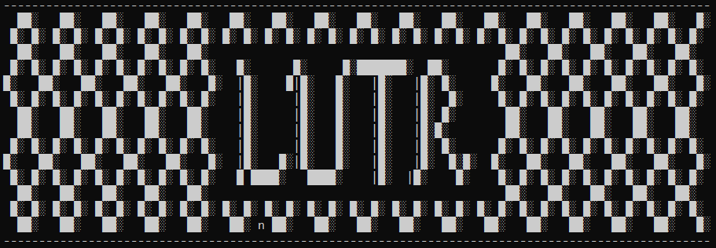
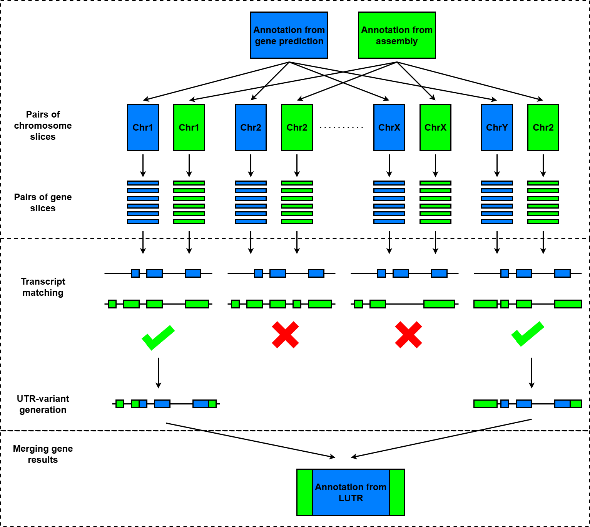
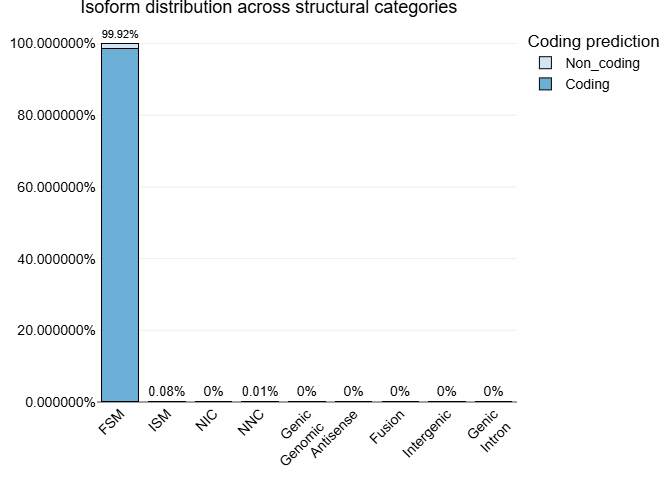

<p align="center">
  
</p>
<p align="center">
  
</p>

When comparing transcripts of the Bible in its original language and the Bible in Latin,
Martin Luther realized that some of its meaning had been lost in translation. Similarly,
UnTranslated Regions (UTRs) are lost in translation. However, to us biologist and
bioinformaticians they are of great importance as they have a variety of regulatory
functions and a genome annotation without them wouldn't really be complete, right?

Protein ortholog-based gene prediction enables the transfer of detailed gene structure and
functional annotations across species by leveraging evolutionary conservation. However,
genome annotations from such methods typically lack the less conserved UTRs. LUTR
supplements these by using matching transcripts from reference-based transcriptome assemblies.

## 1 Installation

```
git clone https://github.com/SimonHegele/LUTR
cd LUTR
conda create -n lutr python=3.13
conda activate lutr
pip install .
```

Additional dependencies required to use the assembly pipeline:
- [AGAT](https://github.com/NBISweden/AGAT)
- [Minimap2](https://github.com/lh3/minimap2)
- [Samtools](https://github.com/samtools/samtools)
- [STAR](https://github.com/alexdobin/STAR)
- [StringTie](https://github.com/gpertea/stringtie)

## 2 Usage

```
usage: LUTR [-h] [-mf] [-mb] [-nm] [-ma] [-s] [-mupl] [-r] [-t] [-v] [-l] prediction assembly outdir

                    ----------------------------------------------------------------------------------------------------
                      ██░   ██░   ██░   ██░   ██░   ██░   ██░   ██░   ██░   ██░   ██░   ██░   ██░   ██░   ██░   ██░   █░
                     █░ █░ █░ █░ █░ █░ █░ █░ █░ █░ █░ █░ █░ █░ █░ █░ █░ █░ █░ █░ █░ █░ █░ █░ █░ █░ █░ █░ █░ █░ █░ █░ █░
                      ██░   ██░   ██░   ██░   ██░                                          ██░   ██░   ██░   ██░   ██░
                     █░ █░ █░ █░ █░ █░ █░ █░ █░ █░   █░      █░     █░███████░  ██░       █░ █░ █░ █░ █░ █░ █░ █░ █░ █░
                    █░   ██░   ██░   ██░   ██░   █░  |█░    █|█░   █░   |█░   |█░ █░     █░   ██░   ██░   ██░   ██░   █░
                     █░ █░ █░ █░ █░ █░ █░ █░ █░ █░   |█░     |█░   █░   |█░   |█░  █░     █░ █░ █░ █░ █░ █░ █░ █░ █░ █░
                      ██░   ██░   ██░   ██░   ██░    |█░     |█░   █░   |█░   |█░ █░       ██░   ██░   ██░   ██░   ██░
                      ██░   ██░   ██░   ██░   ██░    |█░     |█░   █░   |█░   |█░█░        ██░   ██░   ██░   ██░   ██░
                     █░ █░ █░ █░ █░ █░ █░ █░ █░ █░   |█░     |█░   █░   |█░   |█░ █░      █░ █░ █░ █░ █░ █░ █░ █░ █░ █░
                    █░   ██░   ██░   ██░   ██░   █░  |█░   █░|█░   █░   |█░   |█░  █░█░  █░   ██░   ██░   ██░   ██░   █░
                     █░ █░ █░ █░ █░ █░ █░ █░ █░ █░   █ ████░   ████░    |█░  |█░    █░    █░ █░ █░ █░ █░ █░ █░ █░ █░ █░
                      ██░   ██░   ██░   ██░   ██░                                          ██░   ██░   ██░   ██░   ██░
                     █░ █░ █░ █░ █░ █░ █░ █░ █░ █░ █░ █░ █░ █░ █░ █░ █░ █░ █░ █░ █░ █░ █░ █░ █░ █░ █░ █░ █░ █░ █░ █░ █░
                      ██░   ██░   ██░   ██░   ██░   ██░   ██░   ██░   ██░   ██░   ██░   ██░   ██░   ██░   ██░   ██░   █░
                    ----------------------------------------------------------------------------------------------------

                    UTR-extensions for transcripts in functional annotations from orthology-based gene prediction tools
                    using matching transcripts in structural annotations from reference-based transcriptome assembly.

                    Additional parameter explanation:
                    *1 By default, LUTR only allows transcript matches in which all other exons between the first and
                       last matched exon must also be matched exactly. This is based on the assumption that UTRs can
                       affect splicing within the coding regions of a transcript, e.g. by changing its secondary
                       structure.
                    *2 By default, LUTR assignes assembled transcripts only to the matching predicted transcripts they
                       share the most bases with. Assigning them to all matching predicted transcripts can increase the
                       number of annotated UTRs but bears the risk of an increased rate of false positives.
                    ----------------------------------------------------------------------------------------------------


positional arguments:
  prediction                    Annotation from gene prediction (GFF)
  assembly                      Annotation from transcriptome assembly (GFF)
  outdir                        Output directory (Must not exist already)

options:
  -h, --help                    show this help message and exit

Transcript matching:
  -mf , --mftm                  Minimum fraction of the predicted transcript to be matched [default: 0.9]
  -mb , --mtbm                  Minimum bases of the predicted transcript to be matched [default: 10,000]
  -nm, --no_match_middle        Allows missing / additional middle exons in the transcrpt matching *1
  -ma, --match_all              Assign assembled transcripts to all matching predicted transcripts *2
  -mupl , --max_utr_piece_len   Limits the length of UTR-pieces allowed in UTR-variants # TODO

Transcript selection:
  -s , --select                 How to select from multiple UTR-variants [choices: shortest, longest, all] [default: all]
  -r, --remove_unsupported      Remove unmatched transcripts

Performance:
  -t , --threads                Number of parallel processes to use [Default:8]

Others:
  -v , --verbosity              Report progress every 10^v genes [default: 0]
  -l , --log_level              [default: info]
```

### 2.1 Input

Input annotations are required to be in GFF3 format.
agat_sp_convert_sp_gxf2gxf.pl from [AGAT](https://github.com/NBISweden/AGAT) can be used to convert from GTF and GFF.

To generate an assembly annotation matching your predicted one you can use the assembly
pipeline described in section 3.

### 2.2 LUTR - parameters

**Transcript matching**

These parameters exist to account for incomplete read data and incompletely assembled
transcripts.

1. mtbm:<br>Assembled transcripts must match predicted transcripts for at least this number of bases
2. mftm:<br>Assembled transcripts must match predicted transcripts for at least this fraction of their bases

Both are only applied to predicted transcripts longer than mftm. Predicted transcripts shorter than this must be matched in full.

**Transcript selection**

1. select:<br>Many transcripts have multiple UTR-variants. You can choose if you want all possible UTR-variants or only the shortest or longest. Independent of your choice all of them will be computed.
2. remove:<br>Removing of unmatched predicted transcripts. Allows to filter potentially incorrectly predicted transcripts and genes.

### 2.3 Output

After completion you will find the following output directory:

| Item | Explanation |
|--|--|
| lutr.gff    | This is your annotation                 |
| lutr.param  | A file that stores the parameters |
| lutr.log    | A file with the log messages of the run
| tmpdir      | A "temporary" folder holding the GFF-slices of the input predicted and assembled genes and those created by lutr. It doesn't get deleted so you can re-run LUTR with different parameters without needing to create the GFF-slices for the predicted and assembled genes again. |
| step_1 | An empty file indicatig that the GFF-slices for the predicted and assembled genes have already been created. |

UTR-variants inherit attributes from their corresponding predicted transcripts. Additionally the prediction tool and assembly tool will be stored in the attributes as well as the range on which they were predicted and assembled.

I recommend running agat_sp_convert_sp_gxf2gxf.pl from AGAT on the output annotation to remove potential duplicated isoforms.

# 3 Assembly pipeline

LUTR comes with an assembly pipeline, for usage information:

```
assembly -h
```

## 4 LUTR workflow

### Step 1: Gene pair slice extraction

LUTR creates GFF-slices for all predicted genes and their overlapping assembled genes.

1. Both GFF-files are loaded into memory at the same time.
2. Both GFF-files are split into slices according to their chromosomes
3. For each chromosome all pairs of overlapping predicted genes and assembled genes are
identified in parallel
4. For each pair of genes their corresponding GFF-slices are extracted and written to a
   "temporary" dirctory.
5. A file "step 1" is created in the output directory. This allows to re-run LUTR with different parameters without the need to perform step 1 again.

### Step 2: Gene pair slice processing
Transcript matching, removal of unsupported transcripts and UTR-variant generation

1. Pairs of predicted and assembled exons are matched exon by exon as shown in the figure below taking into account the set parameters mtbm mftm, allowing matching with partially assembled transcripts. By default assembled transcripts are only assigned to the predicted bases they match and share the most bases with.
2. If parameter --remove was set, unmatched transcripts are removed.
3. Predicted transcripts and assembled transcripts are used to generate UTR-variants if the assembled transcript extends the predicted transcript to one or more sides.
4. UTR-variants are selected according to the --select parameter, replacing the original transcript.

<p align="center">
  
</p>

# 5 Testing LUTR using idealized data

## 5.1 Test data

Idealized dataset generated generated from mouse reference annotation GRCm39

- "Prediction": coding genes and their UTR-clipped mRNAs
  Generated using script [noUTR](https://github.com/SimonHegele/LUTR/blob/main/src/scripts/noUTR.py)
  for UTR-clipping and agat_convert_sp_gxf2gxf.pl from [AGAT] (https://github.com/NBISweden/AGAT)
  for the addition of exons matching the coding sequences and removal of duplicates stemming from mRNAs
  with multiple anotated UTR-variants.
- "Assembly": reference annotation without non-genic and "CDS" features.

## 5.2. Results

### 5.2.1 Basic Annotation statistics

Annotation statistics reported by agat_sp_statistics.pl from [AGAT] (https://github.com/NBISweden/AGAT):

| Annotation              | # genes | # mRNA | # mRNA, UTR | # mRNA, UTR (both sides) | Mean 5'-UTR length | Mean 5'-UTR length | 
|-------------------------|---------|--------|-------------|--------------------------|--------------------|--------------------|
| Reference               | 22192   | 96192  | 94380       | 93379                    | 614                | 1625               |
| Reference (UTR clipped) | 22192   | 68114  | 0           | 0                        | 0                  | 0                  |
| LUTR                    | 22192   | 98317  | 96428       | 95425                    | 617                | 1637               |

### 5.2.2 Analysis of structural isoforms

Annotation statistics reported by [Sqanti3](https://github.com/ConesaLab/SQANTI3)

<p align="center">
  
</p>

FSM      = Full splice match<br>
ISM      = Incomplete splice match<br>
NIC, NNC = Types of novel isoforms

## 5.3 Performance

required RAM:   ~6.2GB
required Time:  00h45m (64 threads, server) / 5h20m (8 threads, laptop)

Data extraction and processing time per highly depends on the number of isoforms.
Extraction: < 1.5s / gene ( 4m max)
Processing: < 5.0s / gene (11m max)

# Citing LUTR

Currently there is no publication on LUTR, please refer to this repository.

# Acknowledgements

I would like to thank the Leibniz Institute on Aging – Fritz Lipmann Institute (FLI)
and the chair of Prof. Dr. Steve Hoffmann in particular for providing me with the
computational ressources required for the development and testing of this tool. 
